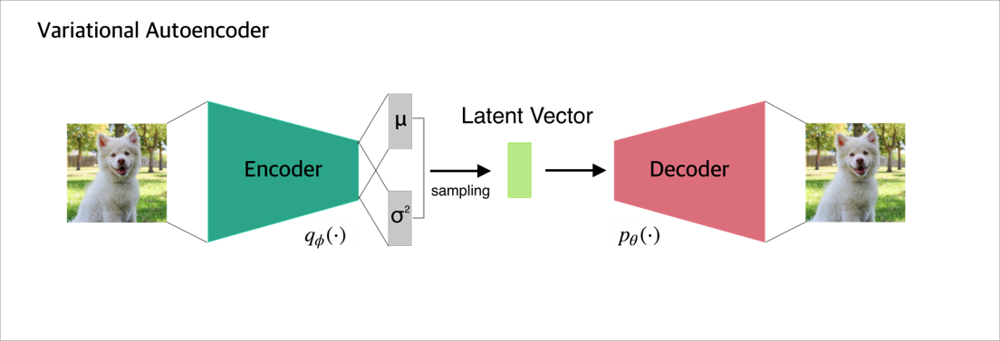

# VAE (Variational autoencoder)
VAE를 사용하여 Continual Learning 환경을 테스트 해보는 프로젝트 입니다.   
0에서 9까지의 숫자들을 순차적으로 학습하는 환경에서 각 Task 마다 학습한 숫자들을 생성하여 재 학습합니다.   
최종적으로 0\~9 숫자들을 모두 생성하는 모델이 되어야 합니다.   
(전체 0\~9 숫자로 학습한 모델과 동일한 결과를 보여야 함)   

   

Encoder
* 주어진 데이터를 잘 설명하는 잠재 변수의 분포를 찾는다.

Decoder
* 잠재 변수로 부터 원본 이미지와 같은 이미지를 복원한다.

## Result

  
  

  

(Left : Full Dataset Learning / Right : Continual Learning)

## Reference
#### Site
* https://datascienceschool.net/view-notebook/c5248de280a64ae2a96c1d4e690fdf79/
* https://www.slideshare.net/ssuser06e0c5/variational-autoencoder-76552518
* http://jaejunyoo.blogspot.com/2017/05/auto-encoding-variational-bayes-vae-3.html
* https://ratsgo.github.io/generative%20model/2018/01/27/VAE/
